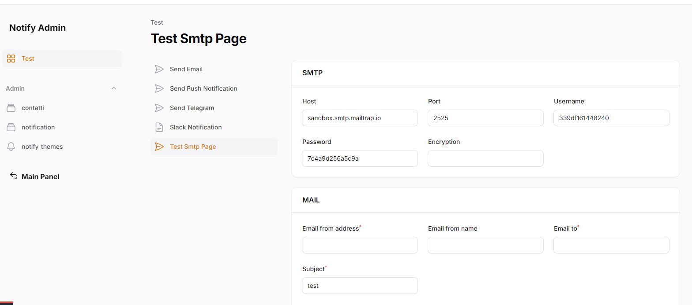

# Test smtp page

E' possibile testare una qualsiasi configurazione smtp tramite la questa pagina di test.

Il sistema rileverà in automatico la configurazione di default, ma si potrà benissimo cambiarla in modo da provarne altre.

<<<<<<< HEAD
Inseriti le varie impostazioni, si potrà verificare il funzionamento di una determinata configurazione email.
## Collegamenti tra versioni di test-smtp-page.md
* [test-smtp-page.md](laravel/Modules/Notify/docs/test-smtp-page.md)
* [test-smtp-page.md](laravel/Modules/Cms/docs/test-smtp-page.md)

=======
Inseriti le varie impostazioni, si potrà verificare il funzionamento di una determinata configurazione email.
>>>>>>> 185a07e (.)
